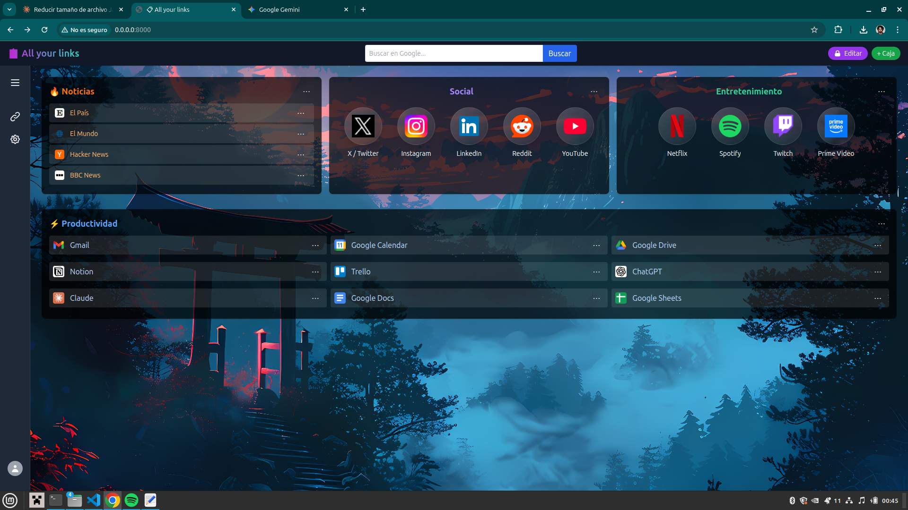
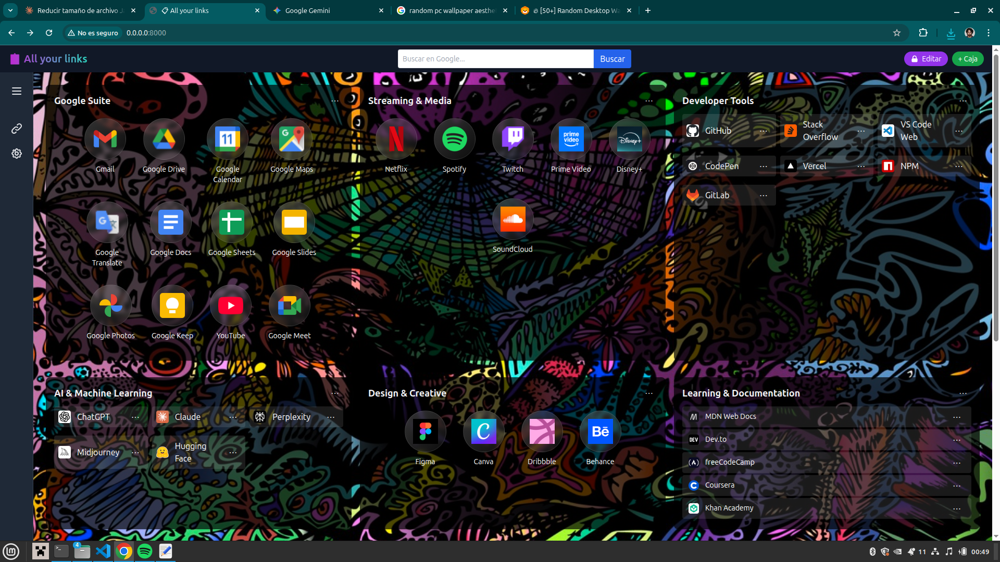
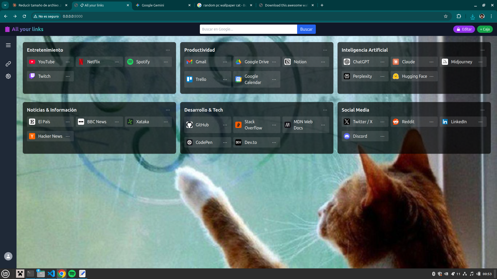

# AllYourLinks - Dashboard personal de enlaces

## 📸 **Vista previa**

<div align="center">
  
</div>

<br>

<div align="center">
  
  &nbsp;
  
</div>

---

## 🚀 **Cómo probarlo**

No necesitas instalar nada. Solo necesitas Python (viene preinstalado en macOS y Linux) y un navegador.

**1. Clona o descarga el repositorio:**
```bash
git clone https://github.com/crayfe/all-your-links.git
cd all-your-links
```

**2. Arranca el servidor local:**
```bash
python3 -m http.server 8000
```

**3. Abre el navegador y accede a:**
```
http://0.0.0.0:8000
```

> ℹ️ El servidor de Python es necesario porque el proyecto usa módulos ES (`type="module"`), que los navegadores bloquean si se abre el HTML directamente como archivo local por restricciones CORS.

**4. (Opcional) Carga datos de ejemplo:**

En el panel lateral ve a ⚙️ **Perfil → Importar** y selecciona el archivo `dashboard_ejemplo.json` incluido en el repositorio para ver el dashboard con contenido de muestra.

---

## **Descripción y motivación**

Este proyecto nació de una necesidad personal: mejorar mi experiencia en internet, disponiendo de un espacio que sea como punto de partida para acceder a todos mis enlaces de interés, todo ello sin depender de extensiones del navegador, servicios de terceros o montones de marcadores desorganizados.

Con este proyecto busco empezar con una arquitectura simple (solo frontend), pero ir creciendo gradualmente a medida que aprendo nuevas cosas que quiero integrar con el fin de tener un dashboard hecho a medida, ya que habiendo otras opciones igual de válidas, o bien tienen características que se quedan cortas para mi gusto y si quieres algo un poco mejor ya te piden pasar por caja. Pues para eso creo mi propio sistema, aprendo y me divierto en el proceso :)

### **Estructura del Proyecto**

```
all-your-links/
├── index.html                    # Página principal
├── style.css                     # Estilos globales
├── dashboard_ejemplo.json        # Datos de ejemplo para importar
├── js/
│   ├── main.js                  # Punto de entrada
│   ├── data-model.js            # Esquemas y factories
│   ├── data-manager.js          # CRUD y persistencia
│   ├── links.js                 # Lógica de enlaces
│   ├── renderer.js              # Renderizado
│   ├── search.js                # Manejador de sugerencias de búsqueda
│   ├── utils.js                 # Utilidades varias
│   └── ui.js                    # Utilidades de UI (toasts, menús)
├── assets/
│   └── fondo.jpg                # Imagen de fondo
├── docs/
│   └── images/
│       ├── example1.png         
│       ├── example2.png      
│       └── example3.png       
└── README.md                    # Este archivo
```
## 📝 **Notas Técnicas**

### **LocalStorage**

Los datos se guardan en `localStorage` con estas keys:
- `workspaces_v2`: Array de workspaces
- `boxes_v2`: Array de cajas
- `items_v2`: Array de items (enlaces)
- `data_version`: Versión del modelo de datos ("2.0")
- `dragEnabled`: Estado del toggle de edición
- `abrirNuevaPestana`: Preferencia de abrir enlaces en nueva pestaña

### **IDs Únicos**

Todos los IDs se generan con el formato: `{prefix}_{timestamp}_{random}`

Ejemplo: `item_1708123456789_a3f2`

Esto garantiza unicidad incluso si se crean múltiples items en el mismo milisegundo.

### **Versionado de Datos**

El campo `data_version` permite hacer migraciones cuando cambia el modelo de datos.

Ejemplo futuro:
```js
if (currentVersion === "2.0" && newVersion === "3.0") {
  migrateFromV2ToV3(data);
}
```

### **Favicons Resilientes**

Sistema de 3 niveles de fallback:
1. **Iconos hardcodeados** (Google Suite y servicios populares)
2. **Google Favicons API** (sz=128 para alta resolución)
3. **SVG genérico** (si todo falla)

---

## 🐛 **Problemas Conocidos**

- **Layout LIST:** Preparado pero no implementado completamente
- **Workspaces:** Solo uno activo, falta navegación en sidebar
- **Mobile:** No optimizado para pantallas pequeñas
- **Sidebar:** El orbe de perfil no es sticky al hacer scroll (diseño aceptable por ahora)
```
## 🗺️ **Roadmap**

### **Fase 1: Frontend Sólido** ✅ (Completada)
- [x] Sistema de cajas y enlaces
- [x] Drag & drop funcional
- [x] Múltiples layouts (grid, orbes, lista)
- [x] Export/import de datos
- [x] UI moderna y responsive (desktop)

### **Fase 2: Mejoras de UX** 🔄 (En Progreso)
- [ ] Navegación entre workspaces en sidebar
- [ ] Layout LIST completamente funcional
- [ ] Responsive mobile (sidebar colapsable, touch-friendly)
- [ ] Búsqueda de enlaces dentro del dashboard
- [ ] Temas de color personalizables

### **Fase 3: Inteligencia Básica** 📊 (Próximamente)
- [ ] Dashboard de "Enlaces más usados"
- [ ] Sugerencias basadas en hora del día
- [ ] Estadísticas de uso (gráficos con Chart.js)
- [ ] Tags y filtrado avanzado
- [ ] Detección automática de duplicados

### **Fase 4: Backend en Raspberry Pi** 🖥️ (Planificado)
- [ ] API REST con Node.js/Express
- [ ] Base de datos (SQLite o PostgreSQL)
- [ ] Autenticación (JWT)
- [ ] Sincronización multi-dispositivo
- [ ] Backup automático

### **Fase 5: Integraciones Avanzadas** 🔗 (Futuro)
- [ ] Integración con Google Drive (segundo cerebro)
- [ ] RSS feeds integrados
- [ ] Notas y marcadores web (Pocket-like)
- [ ] API pública para extensiones de navegador
- [ ] Compartir cajas públicamente (links públicos)

### **Fase 6: Ecosystem Completo** 🌐 (Visión a Largo Plazo)
- [ ] Suite completa de productividad personal
- [ ] Sistema de gestión del conocimiento
- [ ] Integración con IA para sugerencias contextuales
- [ ] Extensión de navegador para añadir enlaces con un click
- [ ] App móvil (PWA o nativa)
