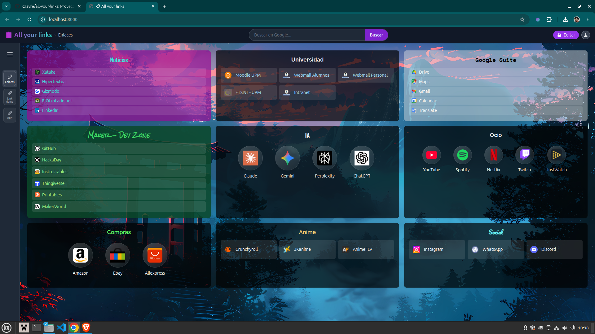
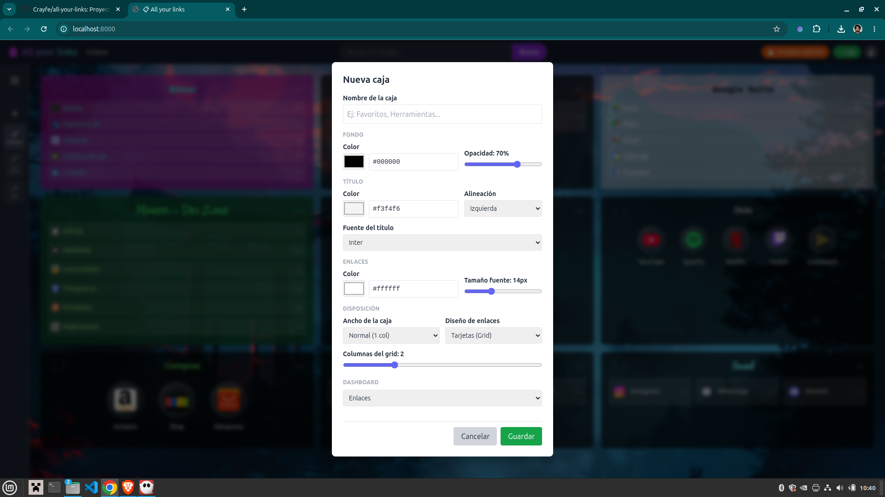
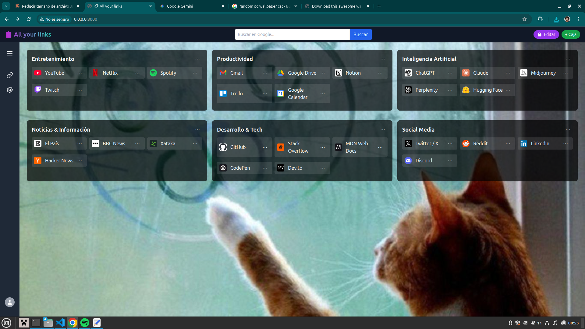

# AllYourLinks — Dashboard personal de enlaces

## Descripción y motivación

Este proyecto nació de una necesidad personal: tener un punto de partida propio para navegar por internet, sin depender de extensiones de terceros, servicios de suscripción ni montones de marcadores desorganizados.

La idea es simple: un dashboard hecho a medida, que crece contigo. Empezó como un gestor de enlaces y ha evolucionado hacia un sistema modular donde cada página es un lienzo en blanco que puedes rellenar con lo que necesites; ya sean enlaces estéticos, organizados, fuentes de investigación, accesos rápidos a cosas iportantes, y lo que vaya surgiendo (Si algo no me gusta o se queda corto, lo cambio. Si necesito algo nuevo, lo construyo) aprendiendo en el progreso.

---

## 📸 Vista previa

<div align="center">
  
</div>

<br>

<div align="center">
  
  &nbsp;
  
</div>

---

## 🚀 Cómo ejecutarlo

De lo único que te tienes que preocupar es de tener un navegador compatible basado en chromium para la persistencia de datos y la extension y por otro lado python para correr un servidor ligero en segundo plano. 

**1. Clona o descarga el repositorio:**
```bash
git clone https://github.com/crayfe/all-your-links.git
cd all-your-links
```

**2. Arranca el servidor local:**
```bash
python3 -m http.server 8000
```

En Windows puedes usar los scripts incluidos en `scripts/` para arrancar y detener el servidor sin abrir una terminal.

**3. Abre el navegador y accede a:**
```
http://localhost:8000
```

> El servidor de Python es necesario porque el proyecto usa módulos ES (`type="module"`), que los navegadores bloquean si se abre el HTML directamente como archivo local por restricciones CORS.

**4. (Opcional) Carga datos de ejemplo:**

En Configuración → Importar, selecciona cualquier archivo `.json` de la carpeta `examples/` para ver el dashboard con contenido de muestra.

**5. (Opcional pero muy recomendable) Instala la extensión:**

Abre `chrome://extensions si usas Chrome o brave://extensions/ si usas Brave, activa el modo desarrollador e importa la carpeta `extension/`. Esto hace que cada nueva pestaña cargue el dashboard automáticamente y habilita las funciones de guardado rápido.

---

## Características

### Dashboard y navegación

| Característica | Descripción |
|---|---|
| Múltiples dashboards | Crea y gestiona varios dashboards independientes, cada uno con su propio contenido y configuración visual |
| Dashboard de inicio | Fija un dashboard como vista por defecto al abrir una nueva pestaña |
| Breadcrumb contextual | La barra superior muestra en todo momento en qué dashboard estás |
| Sidebar adaptable | Panel lateral colapsable con mini-orbes identificativos por dashboard |
| Modo edición | Todos los controles de edición (arrastrar, menús contextuales, crear cajas) están ocultos por defecto y se activan con un botón explícito |

### Cajas

| Característica | Descripción |
|---|---|
| Layouts | Cada caja puede usar uno de cuatro layouts: Grid, Lista, Orbes o Referencia |
| Columnas configurables | Grid y Referencia permiten elegir entre 1 y 5 columnas |
| Personalización visual | Color y opacidad de fondo, color y fuente del título, color y tamaño de fuente de los enlaces |
| Ancho flexible | Las cajas pueden ocupar 1, 2 o 3 columnas del layout principal |
| Densidad vertical | El layout Lista permite elegir entre densidad compacta, normal y espaciada |
| Tamaño de orbes | El layout Orbes permite ajustar el tamaño de cada orbe con un slider |
| Mover entre dashboards | Una caja y todo su contenido puede migrarse a otro dashboard desde el modal de edición |
| Drag & drop | Las cajas se pueden reordenar arrastrando cuando el modo edición está activo |

### Fuentes disponibles para títulos

Inter, Playfair Display, Oswald, Raleway, Space Mono, Pacifico, Rock Salt — cargadas desde Google Fonts.

### Enlaces

| Característica | Descripción |
|---|---|
| Favicons resilientes | Sistema de 3 niveles: iconos hardcodeados para servicios populares → Google Favicons API → SVG genérico |
| Tracking de uso | Cada clic registra `clickCount` y `lastAccessed` para uso futuro en estadísticas |
| Drag & drop entre cajas | Los enlaces se pueden mover entre cajas arrastrando |
| Abrir en nueva pestaña | Preferencia global configurable desde el panel de configuración |

### Layout Referencia

Diseñado para recolectar fuentes durante una investigación. Muestra el título del enlace y la URL en claro, con la URL en tipografía monoespaciada. Soporta múltiples columnas con colapso automático cuando el espacio no es suficiente para mantener una anchura mínima legible.

### Datos

| Característica | Descripción |
|---|---|
| Persistencia | Todo se guarda en `localStorage`, sin servidor ni cuenta necesaria |
| Export / Import | Exporta todos tus datos a JSON y vuelve a importarlos en cualquier momento |
| Fondo personalizado | Sube una imagen como fondo del dashboard, guardada en base64 |
| Versionado | Campo `data_version` para gestionar migraciones futuras del modelo de datos |

---

## 🔌 Extensión para Chromium

La extensión complementa el dashboard con integración directa en el navegador. Está en la carpeta `extension/` y se instala en modo desarrollador.

### Funciones

**Nueva pestaña:** Cada vez que abres una pestaña nueva, la extensión comprueba si el servidor está disponible y redirige automáticamente al dashboard. Si el servidor no está levantado, muestra un mensaje informativo en lugar de una página de error.

**Popup de guardado rápido:** Al hacer clic en el icono de la extensión se abre un popup con el título y la URL de la pestaña activa, precargados y listos para guardar. Puedes editar el título y elegir en qué caja guardarlo, con las cajas agrupadas por dashboard.

**Menú contextual:** Con el botón derecho sobre cualquier enlace de cualquier página web aparece la opción "Guardar link en AllYourLinks". La extensión intenta obtener el título real del enlace en tres pasos: fetch directo a la URL para leer el `<title>`, lectura del nodo `<a>` en el DOM de la página actual, y como fallback usa la URL en claro. El enlace se guarda en la caja configurada como destino por defecto.

### Permisos requeridos

| Permiso | Motivo |
|---|---|
| `activeTab` | Leer la URL y título de la pestaña activa |
| `scripting` | Leer y escribir en el `localStorage` del dashboard |
| `tabs` | Buscar si hay una pestaña del dashboard abierta |
| `contextMenus` | Añadir la opción al menú de botón derecho |
| `host_permissions` | Acceso a `localhost:8000` y a cualquier URL para el fetch de títulos |

---

## Arquitectura del proyecto

### Estructura de carpetas

```
all-your-links/
├── index.html                  # Página principal
├── style.css                   # Estilos globales
├── js/
│   ├── main.js                 # Punto de entrada e inicialización
│   ├── dashboard.js            # Gestión de dashboards: navegación, CRUD, sidebar
│   ├── boxes.js                # Gestión de cajas: CRUD y modal de personalización
│   ├── links.js                # Gestión de enlaces: renderizado, CRUD, delegación de eventos
│   ├── drag.js                 # Drag & drop y modo edición
│   ├── renderer.js             # Creación de nodos DOM (boxCard, linkElement, orbElement, referenceElement)
│   ├── data-manager.js         # CRUD y persistencia en localStorage
│   ├── data-model.js           # Schemas, factories y generador de IDs
│   ├── search.js               # Buscador de Google con sugerencias
│   ├── ui.js                   # Utilidades de UI: toasts, navegación entre secciones, menús
│   └── utils.js                # Utilidades generales: favicons, sanitización, normalización de URLs
├── extension/
│   ├── manifest.json           # Configuración de la extensión (Manifest V3)
│   ├── background.js           # Service worker: menú contextual y guardado desde cualquier página
│   ├── popup.html/css/js       # Popup de guardado rápido desde la pestaña activa
│   └── newtab.html/css/js      # Override de nueva pestaña con redirección al dashboard
├── scripts/                    # Instaladores y desinstaladores para Windows y Linux
├── examples/                   # Archivos JSON de ejemplo para importar
└── docs/
    └── images/                 # Capturas de pantalla para el README
```

### Módulos JS — responsabilidades

| Módulo | Responsabilidad |
|---|---|
| `main.js` | Inicializa todos los módulos, gestiona el fondo personalizado |
| `dashboard.js` | CRUD de dashboards, renderizado del sidebar, navegación entre dashboards, sistema de pin |
| `boxes.js` | CRUD de cajas, modal de personalización con opciones contextuales por layout |
| `links.js` | Renderizado del contenido principal, CRUD de enlaces, export/import, delegación de eventos |
| `drag.js` | Inicialización de Sortable.js, toggle del modo edición, persistencia del estado de edición |
| `renderer.js` | Funciones puras de creación de DOM: `createBoxCard`, `createLinkElement`, `createOrbElement`, `createReferenceElement` |
| `data-manager.js` | Todas las operaciones de lectura/escritura sobre localStorage, aliases de dashboard sobre workspaces |
| `data-model.js` | Schemas de referencia, factories (`createDashboard`, `createBox`, `createLinkItem`), generador de IDs |
| `search.js` | Integración con la API de sugerencias de Google vía proxy CORS |
| `ui.js` | Toasts, alternancia de secciones, cierre de menús contextuales |

### Modelo de datos

El sistema usa tres niveles jerárquicos almacenados en `localStorage` de forma independiente:

```
Dashboard (workspaces_v2)
    └── Box (boxes_v2)
            └── Item (items_v2)
```

Cada nivel referencia al superior por ID. Esta separación permite operaciones eficientes sobre cualquier nivel sin deserializar toda la jerarquía.

| Key localStorage | Contenido |
|---|---|
| `workspaces_v2` | Array de dashboards con `id`, `name`, `active`, `pinned`, `order` |
| `boxes_v2` | Array de cajas con `workspaceId`, configuración visual y de layout |
| `items_v2` | Array de items con `boxId`, `type`, `data` y `metadata` (clickCount, tags) |
| `data_version` | Versión del modelo (`"2.0"`) para gestión de migraciones |
| `dragEnabled` | Estado del modo edición entre sesiones |
| `abrirNuevaPestana` | Preferencia de apertura de enlaces |
| `customBackground` | Imagen de fondo en base64 |

Los IDs siguen el formato `{prefix}_{timestamp}_{random}` (ej: `item_1708123456789_a3f2`) para garantizar unicidad incluso con creación simultánea.

---

## Notas técnicas

### Estrategia de estilos

El proyecto usa una combinación deliberada de Tailwind CSS (vía CDN) y CSS propio en `style.css`. Tailwind gestiona utilidades rápidas de espaciado, colores y tipografía, especialmente en los elementos generados dinámicamente desde JS. El CSS propio gestiona todos los componentes con lógica de estado: sidebar, layouts, drag & drop, modo edición, dashboards. Esta división funciona bien para el estado actual del proyecto. Cuando se implemente el backend (Fase 4), tiene sentido migrar a Tailwind con build step (Vite) para purgar clases no usadas.

### CSS custom properties para personalización de cajas

Cada `box-card` expone variables CSS que los elementos hijos consumen directamente, evitando pasar props a través del DOM:

```css
--link-font-size   /* tamaño de fuente de los enlaces */
--grid-cols        /* número de columnas del grid */
--orb-size         /* tamaño del orbe en px */
--list-padding-y   /* densidad vertical de la lista */
```

### Dependencias circulares en módulos ES

`drag.js` y `boxes.js` necesitan llamar a `renderLinks()` de `links.js`, pero `links.js` los importa a ellos. Se resuelve con `import()` dinámico en los puntos de llamada, que es el patrón estándar para romper dependencias circulares en ES modules sin coste práctico.

### Extensión: lectura y escritura en localStorage del dashboard

La extensión no tiene acceso directo al `localStorage` del dashboard porque cada origen tiene el suyo. Lo resuelve inyectando scripts en la pestaña del dashboard con `chrome.scripting.executeScript`, que sí tiene acceso al `localStorage` de `localhost:8000`. Si no hay ninguna pestaña del dashboard abierta, crea una en segundo plano, opera sobre ella y la cierra.

---

## 🗺️ Roadmap

### Fase 1 — Frontend base (completada)
- [x] Sistema de cajas y enlaces con drag & drop
- [x] Múltiples layouts: Grid, Lista, Orbes, Referencia
- [x] Personalización visual por caja (color, fuente, opacidad, columnas, tamaño de orbes)
- [x] Múltiples dashboards con sistema de pin y navegación en sidebar
- [x] Modo edición que oculta todos los controles de modificación
- [x] Export / import de datos en JSON
- [x] Extensión para Chromium: nueva pestaña, popup de guardado, menú contextual
- [x] Barra de búsqueda integrada con sugerencias de Google

### Fase 2 — Completar el frontend (en progreso)
- [ ] Barra de búsqueda mejorada: selector de motor (Google, DuckDuckGo, Perplexity, Interno) con iconos SVG y estado persistido
- [ ] Buscador interno: vista dedicada con resultados en tiempo real agrupados por caja, coincidencias resaltadas y contexto `Dashboard › Caja › Elemento`
- [ ] Tags en items: añadir y filtrar por etiquetas desde el modal de enlace

### Fase 3 — Widgets (próximamente)
- [ ] Widget de hora, fecha y clima (OpenWeatherMap)
- [ ] Widget de notas estilo Keep — tipo `note` en el modelo de items existente
- [ ] Lector de RSS — via proxy externo, widget dedicado con layout propio
- [ ] Dashboard de uso — visualización del `clickCount` ya trackeado, enlaces más visitados

### Fase 4 — Backend en servidor dedicado (planificado)
- [ ] API REST con Node.js / Express
- [ ] Base de datos SQLite o PostgreSQL — migración desde localStorage
- [ ] Autenticación JWT
- [ ] Sincronización multi-dispositivo
- [ ] Backup automático
- [ ] Migración a Tailwind con build step (Vite) para CSS optimizado

### Fase 5 — Integraciones avanzadas (futuro)
- [ ] Dashboard de inversiones con APIs financieras autenticadas y gráficos
- [ ] Panel de control para ESP32 — Raspberry como broker intermediario
- [ ] Extensión mejorada sincronizada con el backend
- [ ] Responsive mobile / PWA

---

